class: center

```{r setup, include=FALSE}
options(htmltools.dir.version = FALSE)
```

# Introduction to gganimate

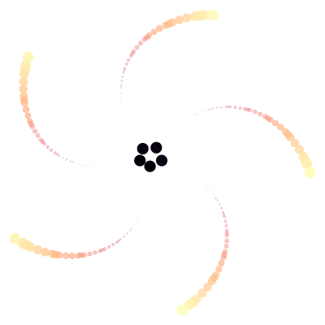

#### October 2018 -- Oxford R user group

#### Kaspar Märtens (@kasparmartens)

---
class: middle, center, inverse

# What is gganimate?

---

# gganimate

* Written by Thomas Lin Pedersen

    * It is a complete rewrite of the first iteration of the gganimate package (by David Robinson) with a new API

.center[
  
]

Resources: 

* See his UseR keynote talk on The Grammar of Animation https://youtu.be/21ZWDrTukEs


* https://github.com/thomasp85/gganimate 

    * Check out the wiki page for examples!

---
class: middle, center, inverse

# Motivating example

---
# Gapminder data: static plots

.center[
  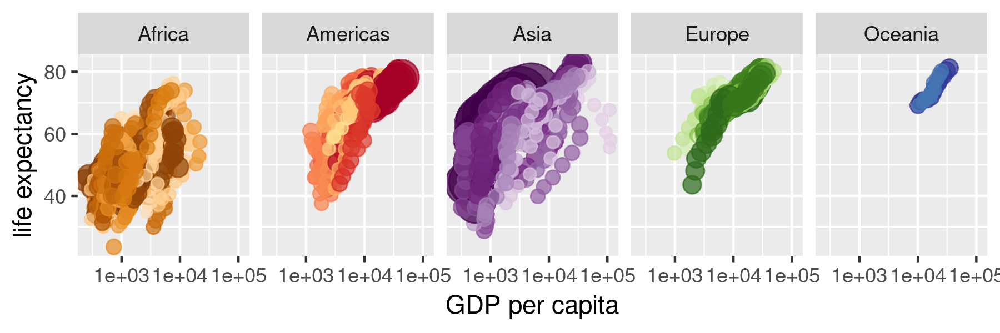
]

.center[
  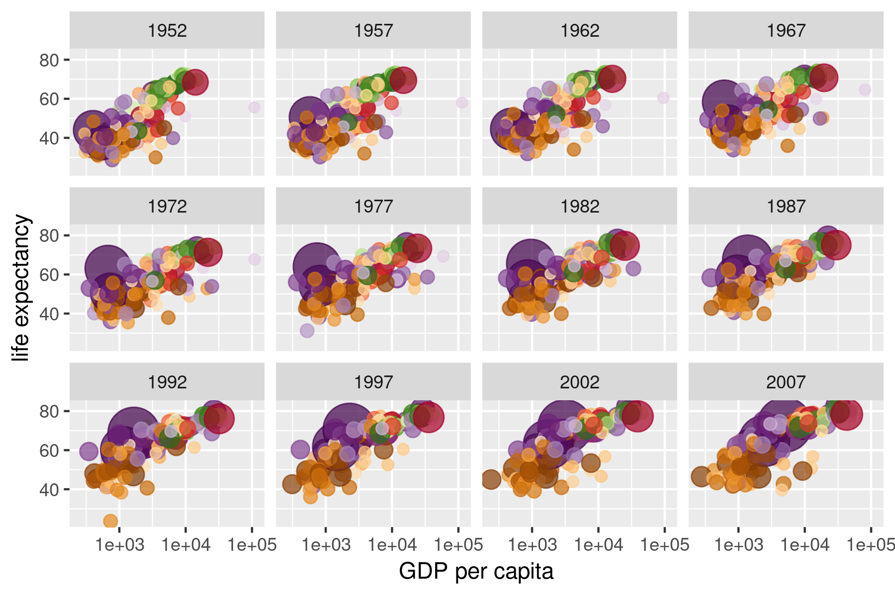
]

---
# Gapminder data: animation

.center[
  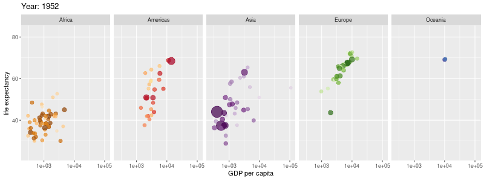
]

---
class: middle, center, inverse

# Static vs interactive graphs


---

# Static vs interactive graphs

### How does animation relate to these?

.center[
  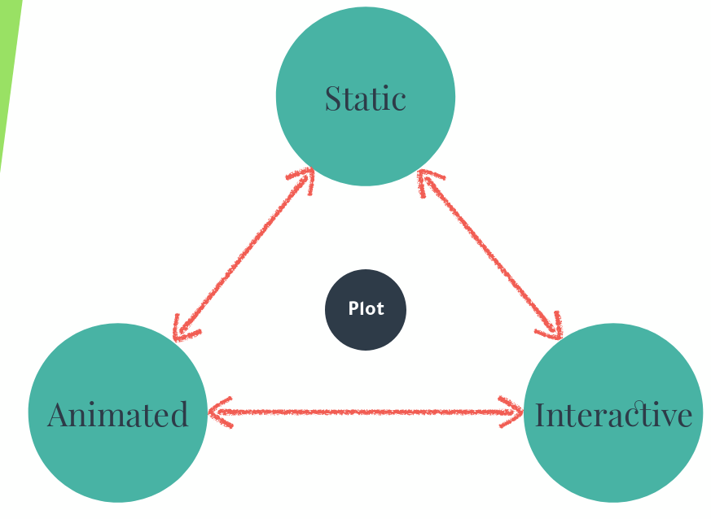
]

.footnote[Source: www.data-imaginist.com/slides/user2018]


---

# gganimate vs other tools

There is always a tradeoff between how flexible a tool is and how much effort is needed from the user

--

E.g. the `animation` package in R lets us animate any sequence of (potentially unrelated) plots

```{r, eval=FALSE}
library(animation)
saveGIF({
  for(i in ...){
    p <- ... # create plot
    plot(p)
  }
})
```

--

E.g. D3.js is a very flexible framework, but creating figures can be quite time consuming!

--

In comparison, gganimate introduces the grammar of animation:

* building upon ggplot2 syntax (rather than wrapping it)
* introducing new grammar


---
class: middle, center, inverse

# Brief recap: 

# grammar of graphics 

# and ggplot2

---
# Grammar of graphics

.center[
  
]

Provides simple, decomposable building blocks. 

---

# Grammar of graphics example


```{r, eval=FALSE}
library(ggplot2)
gapminder %>%
  ggplot(aes(x = gdpPercap, y = lifeExp, size = pop, colour = country)) +
  geom_point() +
  scale_x_log10() +
  facet_wrap(~ year)
```

.pull-left[
  
]

.pull-right[
  
]

---
# Existing and new grammar

.pull-left[
### ggplot2

* `aes`

* `geom_*`

* `stat_*`

* `position_*`

* `scale_*`

* `coord_*`

* `facet_*`
]

--
.pull-right[
### gganimate

* `transition_*`

* `view_*`

* `shadow_*`

* `enter_*`, `exit_*`

* `ease_aes*`
]

---
# Transition_time

Describes how data changes over time. 

--

.pull-left[
#### Static

  ```{r, eval=FALSE}
  df %>%
    ggplot(aes(x, y, col = time)) +
    geom_point(size=4)
  ```
  
  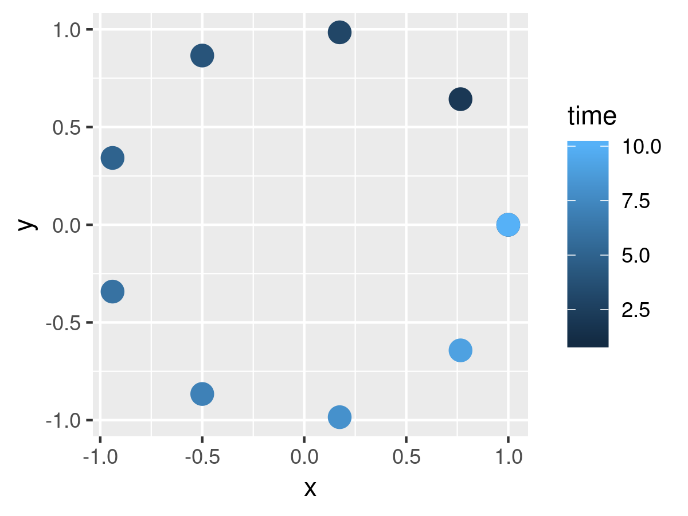
]

--

.pull-right[
#### Animated

```{r, eval=FALSE}
df %>%
  ggplot(aes(x, y, col = time)) +
  geom_point(size=4) +
  transition_time(time)
```

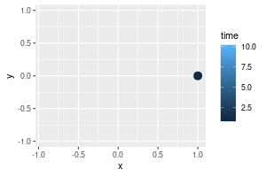
]
---
# Transition_states (for discrete "time")


.pull-left[
#### Static

```{r, eval=FALSE}
df %>%
  ggplot(aes(x, y, col = type)) +
  geom_point(size=4)
```
  
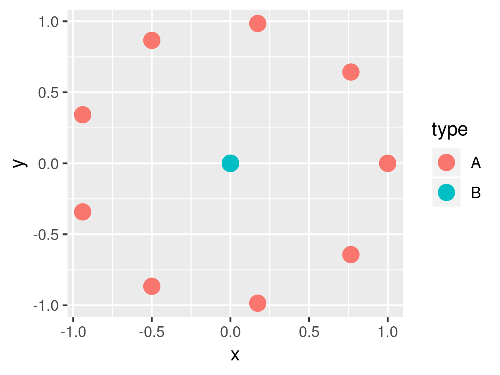
]

--

.pull-right[
#### Animated

```{r, eval=FALSE}
df %>%
  ggplot(aes(x, y, group = time)) +
  geom_point(size=4) +
  transition_states(type, transition_length = 3, state_length = 1)
```

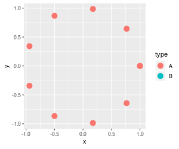
]

---
# View_*

Defines how panning and zooming change over animation (x and y limits). 
--
Example of `view_zoom_manual`:


.center[
  
]

.footnote[Source: https://gist.github.com/thomasp85/9362bbfae956f2690794abeb2c11cdcc]

---
### Another example

Combining `transition_states` and  `transition_states`

.center[
  
]

.footnote[Source: https://github.com/thomasp85/gganimate/wiki/Moving-Hawaii-and-Alaksa]

---
### Shadow_*

Leave behind a trace

```{r, eval=FALSE}
df %>%
  ggplot(aes(x, y, col = time)) +
  geom_point(size=4) +
  transition_time(time) +
  shadow_wake(1.0, wrap = TRUE)
```

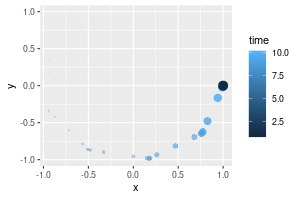

---

# More examples: Shadow_*

<blockquote class="twitter-tweet" data-lang="en"><p lang="en" dir="ltr">shadow_wake just got a little bit more powerful <a href="https://t.co/NLOtflgKS0">pic.twitter.com/NLOtflgKS0</a></p>&mdash; Thomas Lin Pedersen (@thomasp85) <a href="https://twitter.com/thomasp85/status/1041979225018916864?ref_src=twsrc%5Etfw">September 18, 2018</a></blockquote>
<script async src="https://platform.twitter.com/widgets.js" charset="utf-8"></script>


---
# More examples: Shadow_*


---

# Enter and exit

Define how data should appear / disappear during the animation

Example of `enter_fade() + exit_shrink()`

.center[
  
]

.footnote[Source: https://github.com/thomasp85/gganimate]

---
# Ease_aes

Defines how data should be interpolated (uses the tweenr package under the hood)

--

.pull-left[
`ease_aes("cubic-in-out")`

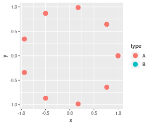
]

.pull-right[
`ease_aes("bounce-in-out")`


]
---
# Back to the gapminder example

```{r, eval=FALSE}
ggplot(gapminder, aes(gdpPercap, lifeExp, size = pop, colour = country)) +
  geom_point(alpha = 0.7) +
  scale_colour_manual(values = country_colors) +
  scale_size(range = c(2, 12)) +
  scale_x_log10() +
  facet_wrap(~continent, nrow=1) +
  theme(legend.position = 'none') +
  labs(title = 'Year: {frame_time}', x = 'GDP per capita', y = 'life expectancy') +
  {{transition_time(year) +}}
  {{ease_aes('linear')}}
```

.center[
  
]

---
class: middle

# More cool example use-cases (from twitter)

---

<blockquote class="twitter-tweet" data-lang="en"><p lang="en" dir="ltr">Today&#39;s episode of &quot;fun and games with gganimate&quot; is a two-dimensional brownian bridge simulation! I am just amazed at how simple everything is with this package <a href="https://twitter.com/hashtag/rstats?src=hash&amp;ref_src=twsrc%5Etfw">#rstats</a> <a href="https://twitter.com/thomasp85?ref_src=twsrc%5Etfw">@thomasp85</a> <a href="https://t.co/eQsQp6Arv8">pic.twitter.com/eQsQp6Arv8</a></p>&mdash; Danielle Navarro (@djnavarro) <a href="https://twitter.com/djnavarro/status/1033100989912440832?ref_src=twsrc%5Etfw">August 24, 2018</a></blockquote>
<script async src="https://platform.twitter.com/widgets.js" charset="utf-8"></script>

---

<blockquote class="twitter-tweet" data-lang="en"><p lang="en" dir="ltr">transition_reveal is, *ahem*, revealed... <a href="https://twitter.com/hashtag/rstats?src=hash&amp;ref_src=twsrc%5Etfw">#rstats</a> <a href="https://twitter.com/hashtag/gganimate?src=hash&amp;ref_src=twsrc%5Etfw">#gganimate</a> <a href="https://t.co/9K4gT5xDyh">pic.twitter.com/9K4gT5xDyh</a></p>&mdash; Thomas Lin Pedersen (@thomasp85) <a href="https://twitter.com/thomasp85/status/1036915662025895936?ref_src=twsrc%5Etfw">September 4, 2018</a></blockquote>
<script async src="https://platform.twitter.com/widgets.js" charset="utf-8"></script>

---

<blockquote class="twitter-tweet" data-lang="en"><p lang="en" dir="ltr">Putting Hawaii and Alaska into their place. <a href="https://twitter.com/hashtag/rstats?src=hash&amp;ref_src=twsrc%5Etfw">#rstats</a> <a href="https://twitter.com/hashtag/dataviz?src=hash&amp;ref_src=twsrc%5Etfw">#dataviz</a> <a href="https://twitter.com/hashtag/gganimate?src=hash&amp;ref_src=twsrc%5Etfw">#gganimate</a> <a href="https://t.co/JOMWlVv3A9">pic.twitter.com/JOMWlVv3A9</a></p>&mdash; Claus Wilke (@ClausWilke) <a href="https://twitter.com/ClausWilke/status/1026190740370731009?ref_src=twsrc%5Etfw">August 5, 2018</a></blockquote>
<script async src="https://platform.twitter.com/widgets.js" charset="utf-8"></script>

---

<blockquote class="twitter-tweet" data-lang="en"><p lang="en" dir="ltr">Excited that <a href="https://twitter.com/hashtag/ggspatial?src=hash&amp;ref_src=twsrc%5Etfw">#ggspatial</a> works with <a href="https://twitter.com/hashtag/gganimate?src=hash&amp;ref_src=twsrc%5Etfw">#gganimate</a> out of the box! This is a first try at zooming around multiple core locations from our latest Halifax lakes paper! <a href="https://t.co/XnTLa7dfm5">https://t.co/XnTLa7dfm5</a> <a href="https://t.co/zuLsBLb428">https://t.co/zuLsBLb428</a> <a href="https://twitter.com/hashtag/rstats?src=hash&amp;ref_src=twsrc%5Etfw">#rstats</a> <a href="https://twitter.com/hashtag/dataviz?src=hash&amp;ref_src=twsrc%5Etfw">#dataviz</a> <a href="https://twitter.com/hashtag/gis?src=hash&amp;ref_src=twsrc%5Etfw">#gis</a> <a href="https://t.co/tD8jtiQ8g9">pic.twitter.com/tD8jtiQ8g9</a></p>&mdash; Dewey Dunnington (@paleolimbot) <a href="https://twitter.com/paleolimbot/status/1026195093101965320?ref_src=twsrc%5Etfw">August 5, 2018</a></blockquote>
<script async src="https://platform.twitter.com/widgets.js" charset="utf-8"></script>

---

<blockquote class="twitter-tweet" data-lang="en"><p lang="en" dir="ltr">First steps with <a href="https://twitter.com/hashtag/gganimate?src=hash&amp;ref_src=twsrc%5Etfw">#gganimate</a>. Trying to animate Minard&#39;s &quot;March of Napoleon&quot;. The temperature labels annoy me a bit. <a href="https://twitter.com/hashtag/rstats?src=hash&amp;ref_src=twsrc%5Etfw">#rstats</a> <a href="https://t.co/f4lrKr6h1D">pic.twitter.com/f4lrKr6h1D</a></p>&mdash; David Schoch (@schochastics) <a href="https://twitter.com/schochastics/status/1048190195085062144?ref_src=twsrc%5Etfw">October 5, 2018</a></blockquote>
<script async src="https://platform.twitter.com/widgets.js" charset="utf-8"></script>

---

<blockquote class="twitter-tweet" data-conversation="none" data-lang="en"><p lang="en" dir="ltr">I really like how easily the gganimate calls fit in with the ggplot pipeline. It&#39;s very clear <a href="https://twitter.com/thomasp85?ref_src=twsrc%5Etfw">@thomasp85</a> put a lot of thought and care into the API design. <a href="https://t.co/hnoqVw4eGG">pic.twitter.com/hnoqVw4eGG</a></p>&mdash; Garrick Aden-Buie (@grrrck) <a href="https://twitter.com/grrrck/status/1029569636872929281?ref_src=twsrc%5Etfw">August 15, 2018</a></blockquote>
<script async src="https://platform.twitter.com/widgets.js" charset="utf-8"></script>

https://github.com/gadenbuie/tidyexplain

---

<blockquote class="twitter-tweet" data-lang="en"><p lang="en" dir="ltr">After watching <a href="https://twitter.com/standupmaths?ref_src=twsrc%5Etfw">@standupmaths</a> latest video, decided to re-create the <br>Lissajous curve animation by <a href="https://twitter.com/juliomulero?ref_src=twsrc%5Etfw">@juliomulero</a> using <a href="https://twitter.com/hashtag/rstats?src=hash&amp;ref_src=twsrc%5Etfw">#rstats</a> and <a href="https://twitter.com/hashtag/gganimate?src=hash&amp;ref_src=twsrc%5Etfw">#gganimate</a>. <a href="https://t.co/9Nm3bDn2yg">pic.twitter.com/9Nm3bDn2yg</a></p>&mdash; Wouter van der Bijl (@_Axeman_) <a href="https://twitter.com/_Axeman_/status/1041286690357354496?ref_src=twsrc%5Etfw">September 16, 2018</a></blockquote>
<script async src="https://platform.twitter.com/widgets.js" charset="utf-8"></script>

---

<blockquote class="twitter-tweet" data-lang="en"><p lang="en" dir="ltr"><a href="https://twitter.com/hashtag/RStats?src=hash&amp;ref_src=twsrc%5Etfw">#RStats</a> — Using {gganimate} to recreate a well-known optical illusion : <br><br>&quot;Remaking ‘Luminance-gradient-dependent lightness illusion’ with R&quot;<a href="https://t.co/jZNVs73SAy">https://t.co/jZNVs73SAy</a> <br><br>via <a href="https://twitter.com/thinkR_fr?ref_src=twsrc%5Etfw">@thinkR_fr</a> <a href="https://t.co/OIAoBg5tyf">pic.twitter.com/OIAoBg5tyf</a></p>&mdash; Colin Fay 🤘 (@_ColinFay) <a href="https://twitter.com/_ColinFay/status/1030021275777937408?ref_src=twsrc%5Etfw">August 16, 2018</a></blockquote>
<script async src="https://platform.twitter.com/widgets.js" charset="utf-8"></script>

---

<blockquote class="twitter-tweet" data-lang="en"><p lang="en" dir="ltr">Turns out, <a href="https://twitter.com/hashtag/gganimate?src=hash&amp;ref_src=twsrc%5Etfw">#gganimate</a> is also great for visualizing linear algebra concepts like eigenvectors and eigenvalues.  <a href="https://twitter.com/hashtag/rstats?src=hash&amp;ref_src=twsrc%5Etfw">#rstats</a> <a href="https://t.co/rMnCmPN5ud">pic.twitter.com/rMnCmPN5ud</a></p>&mdash; Adam Birenbaum (@BirenbaumAdam) <a href="https://twitter.com/BirenbaumAdam/status/1035567182661472257?ref_src=twsrc%5Etfw">August 31, 2018</a></blockquote>
<script async src="https://platform.twitter.com/widgets.js" charset="utf-8"></script>

---
# Summary

Building upon ggplot2, gganimate provides a flexible easy-to-use framework for creating cool animations

Resources:

* https://github.com/thomasp85/gganimate (also, see its wiki!)
* UseR talk on The Grammar of Animation by Thomas Lin Pedersen https://youtu.be/21ZWDrTukEs

--

### Thank you! 

Some of the code available: https://github.com/kasparmartens/2018_10_gganimate

.footnote[Kaspar Märtens (@kasparmartens)]
